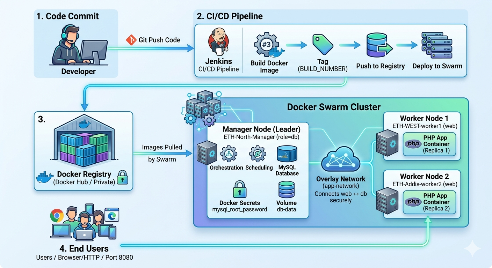

# DevOps PHP Todo App — Deployment 2 (Docker Swarm + Jenkins)

## Project Title
Deployment 2 — Scalable Containerized PHP Todo Application using Docker Swarm, Jenkins Pipeline, and Monitoring Stack

---

## Project Overview

This project represents the second deployment iteration of a simple PHP-based Todo List application that uses a MySQL database for storage.

In the previous deployment, the application was built and deployed using:

- Docker  
- Docker Compose  
- Jenkins (Freestyle Jobs)  

While functional, that setup was limited to single-node environments and lacked scalability, orchestration, and production-grade features.

---

## What’s New in This Deployment?

This version upgrades the application to a more scalable and production-ready architecture using:

- Docker Swarm — Container orchestration and clustering  
- Docker Stack — Multi-service deployment  
- Jenkins Pipeline — CI/CD automation  
- Docker Secrets — Secure credential management  
- Monitoring Stack:
  - Prometheus
  - Grafana
  - cAdvisor  
- Swarm Visualizer — Cluster visualization  
- Health Checks — Automatic failure detection  
- Resource Limits — CPU and memory control for containers  

---

## Key Objectives

This project demonstrates:

- Container orchestration using Docker Swarm  
- Multi-node cluster setup (Manager + Workers)  
- Service scaling and load distribution  
- CI/CD automation using Jenkins Pipeline  
- Secure handling of sensitive data using Docker Secrets  
- Monitoring and observability of workloads  
- Zero-downtime deployments using rolling updates  

---

## Environment Setup

The project is deployed on 3 AWS EC2 instances, simulating a clustered environment.

### Infrastructure

- 3 EC2 Instances
  - 1 Manager Node  
  - 2 Worker Nodes  
- Operating System: Ubuntu Server 22.04  
- Docker Engine installed on all nodes  

---

## Networking

- All instances are deployed within the same VPC and subnet  
- Communication between nodes is handled using a Docker Swarm overlay network  

### Security Group Configuration

#### Public Access

| Service    | Port | Access        |
|------------|------|---------------|
| SSH        | 22   | Your IP       |
| HTTP App   | 8080 | 0.0.0.0/0     |
| Grafana    | 3000 | Your IP/Public|
| Prometheus | 9090 | Your IP       |
| Visualizer | 8081 | Your IP       |
| cAdvisor   | 8082 | Your IP       |

#### Internal (Swarm Communication)

| Service          | Port  | Access   |
|------------------|-------|----------|
| Swarm Management | 2377  | Same SG  |
| Swarm Gossip     | 7946  | Same SG  |
| Overlay Network  | 4789  | Same SG  |

---

## Access & Configuration

- SSH access via key pair authentication  
- Node roles managed using Docker labels  

### Creating Secrets

  ```bash
  docker secret create mysql_root_password secret.txt
  ```

---

## High-Level Architecture



### 🖼️ High-Level CI/CD + Swarm Architecture

This diagram illustrates the complete DevOps workflow:

Git Push → Jenkins CI/CD → Docker Image Build → Docker Registry → Docker Swarm Deployment

The system runs a PHP Todo application with a MySQL database, deployed as a distributed service using Docker Swarm.

#### Key Components

- Web service replicas for scalability  
- Manager node handling orchestration and database  
- Overlay network for secure communication  
- Docker secrets and volumes for security and persistence  

---

### 🖼️ Docker Swarm Cluster Visualization


This diagram represents the internal Docker Swarm cluster structure.

#### Cluster Setup

- One Manager node running:
  - Orchestration  
  - MySQL database  
  - Prometheus  
  - Grafana  
  - Swarm Visualizer  

- Multiple Worker nodes running:
  - PHP application replicas  

#### Monitoring Stack

- cAdvisor collects container metrics on each node  
- Prometheus aggregates metrics  
- Grafana provides dashboards and visualization  

#### Networking

- Overlay networks enable secure cross-node communication  

This setup ensures scalability, monitoring, and service discovery within the cluster.

---

### 🖼️ AWS Infrastructure Architecture


This diagram shows the AWS infrastructure used for deployment.

#### Infrastructure Overview

- 3 EC2 Instances inside a Default VPC  
  - 1 EC2 → Swarm Manager node  
  - 2 EC2 → Worker nodes running application containers  

#### Networking & Security

- Security Groups control access to:
  - Application ports  
  - Monitoring tools  

- Public subnet is used for simplicity in this project  

---

## Project File Structure

The repository follows a clean and organized structure to separate application code, infrastructure configuration, and DevOps automation.

```bash
devops-php-todo
│
├── app/                        # PHP application source code
│   ├── index.php
│   ├── add.php
│   ├── edit.php
│   ├── delete.php
│   ├── db.php
│   └── styles.css
│
├── Dockerfile                  # Docker image definition
│
├── docker-compose.yml          # Project 1 (Compose setup)
├── docker-stack.yml            # Project 2 (Swarm deployment)  ✅ NEW
│
├── monitoring-stack.yml        # Monitoring stack (Prometheus + Grafana + cAdvisor) ✅ NEW
├── prometheus.yml              # Prometheus configuration ✅ NEW
│
├── .env                        # Environment variables (Compose)
├── .dockerignore
│
├── Architecture/               # Architecture diagrams
│
├── Jenkins/                    # Jenkins configurations
│   ├── Jenkinsfile             # Pipeline definition ✅ NEW
│   ├── JENKINS1.md             # Project 1 explanation (Compose)
│
├── README-Jenkins-compose-deployment.md     # Project 1 documentation
├── README-dockerswarm-deployment.md         # Project 2 documentation ✅ NEW
│
└── README.md                   # Main project overview
```

## 🐳 Docker Implementation (Project 2 — Swarm Upgrade)

### 📌 Recap: Previous Deployment (Project 1)

In the previous version of this project, the application was deployed using:

- Docker + Docker Compose  
- Jenkins Freestyle CI/CD job  
- Two-container setup (PHP + MySQL)  
- Bind mounts for development speed  
- Single-host deployment (no clustering)  

👉 This setup worked well for local/single-server environments but lacked:

- Scalability  
- Orchestration  
- High availability  
- Monitoring  

---

### 🚀 What’s NEW in This Deployment (Project 2)

This version upgrades the system into a distributed containerized architecture using Docker Swarm and advanced DevOps practices.

---

### 🔥 New Improvements

- Docker Swarm clustering (multi-node system)  
- Docker Stack deployment instead of Compose  
- Jenkins Pipeline (instead of freestyle jobs)  
- Service replication (scalability)  
- Rolling updates and rollback strategy  
- Resource limits (CPU and memory control)  
- Health checks for self-healing services  
- Docker Secrets for secure credentials  
- Monitoring stack (Prometheus + Grafana + cAdvisor)  
- Swarm Visualizer for cluster visibility  
- Overlay networking for secure cross-node communication  

---

# 🏗️ Docker Swarm Architecture

This architecture introduces a distributed system where services run across multiple EC2 nodes managed by Docker Swarm.

- Manager node handles orchestration, database, and monitoring tools  
- Worker nodes run replicated PHP application containers  
- Jenkins automates build → push → deploy workflow  
- Docker Registry stores versioned images  
- Overlay network connects all services securely  

---

# 🐳 Docker Stack Implementation

Unlike Docker Compose (single-host), Docker Stack is used for multi-node orchestration.

It enables:

- Service replication across nodes  
- Declarative infrastructure deployment  
- Rolling updates without downtime  
- Automatic container rescheduling on failure  

### Example services:

- `web` → PHP application (replicated)  
- `db` → MySQL (single persistent service)  

---

# 🌐 Docker Networking (Overlay Network)

Docker Swarm uses an overlay network:

- Enables communication across multiple EC2 instances  
- Allows services to connect using service names (not IPs)  
- Ensures secure internal traffic between containers  

### Example:


web → db (via service name, not IP)


---

# 💾 Persistent Storage (Volumes)

Database persistence is handled using Docker volumes:

- Ensures data is not lost when containers restart  
- MySQL data stored outside container lifecycle  
- Mounted at:


/var/lib/mysql


---

# 🔐 Docker Secrets (Security Upgrade)

Instead of `.env` passwords, this project uses:

- Docker Secrets for MySQL credentials  
- Secrets stored securely in Swarm manager  
- Injected at runtime into containers  

### Benefits:

- No plain-text passwords in images  
- Secure runtime configuration  
- Better production security  

---

# 📊 Monitoring & Visualization Stack

This project introduces full observability using:

- **Prometheus** → metrics collection  
- **Grafana** → dashboards and visualization  
- **cAdvisor** → container-level monitoring  
- **Swarm Visualizer** → cluster topology view  

---

# ⚙️ CI/CD Pipeline (Jenkins Pipeline Upgrade)

Unlike the previous freestyle job, this version uses a Jenkins Pipeline.

### Flow:


Git Push → Jenkins Pipeline → Build Image → Push Registry → Deploy Swarm Stack


### Key Improvements:

- Automated versioning using build numbers  
- Docker image tagging strategy  
- Stack deployment instead of compose  
- Fully automated Swarm updates  

---

# 🧪 Health Checks & Reliability

Each service includes health checks:

- Ensures containers are running correctly  
- Enables automatic restart on failure  
- Improves system resilience  

---

# 📦 Resource Management

Resource limits are applied per container:

- CPU limits  
- Memory limits  

### This ensures:

- Fair resource usage  
- Cluster stability  
- Protection against overloaded containers  

---

# 🧠 Summary

This project upgrades a simple Docker Compose application into a production-style distributed system.

It demonstrates:

- Container orchestration (Swarm)  
- CI/CD automation (Jenkins Pipeline)  
- Monitoring & observability  
- Secure secret management  
- Scalable architecture design  

---

# 🚀 Next Step (Project 3 Preview)

Future improvements will introduce:

- AWS Load Balancer (ELB)  
- RDS managed database  
- Route 53 DNS  
- HTTPS with SSL certificates  
- Production-grade cloud-native architecture  