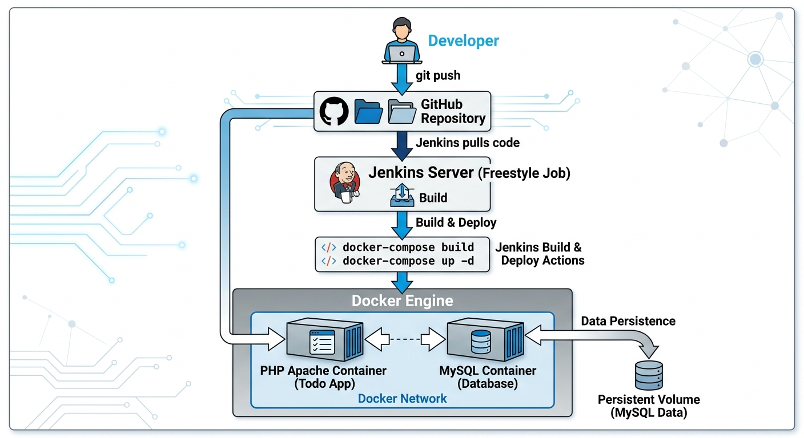
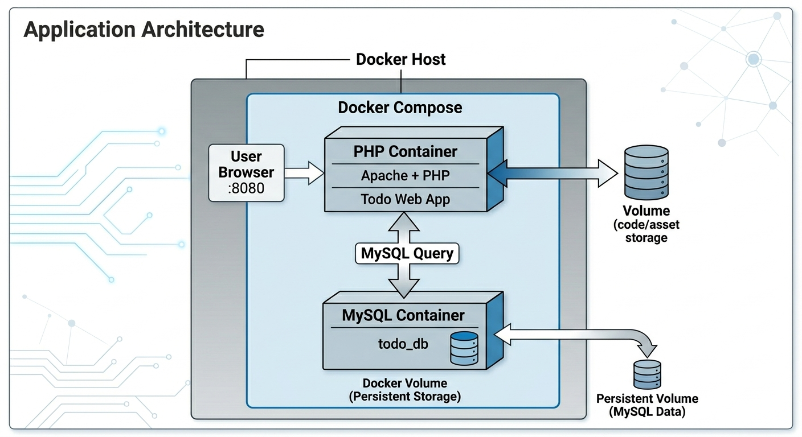

# DevOps PHP To-Do List Application

## Project Overview

This project demonstrates a **simple DevOps workflow** by containerizing and deploying a PHP web application using **Docker, Docker Compose, and Jenkins Freestyle CI**.

The application itself is a **PHP-based To-Do List Manager** that allows users to:

* Add new tasks
* Update tasks
* Mark tasks as completed
* Track task status
* Delete tasks

All application data is stored in a **MySQL database**, ensuring persistence and structured data management.

The goal of this project is not only to build a web application but also to demonstrate **modern DevOps practices**, including:

* Application containerization
* Multi-container orchestration
* CI automation
* Infrastructure design
* Environment configuration
* Secure handling of environment variables

---

# Application Features

The PHP application provides a lightweight task management system.

Users can:

* Create new tasks
* Update existing tasks
* Mark tasks as completed
* Pause tasks
* Delete tasks
* Store and retrieve all data from a MySQL database

The database ensures that tasks persist even if the web container is restarted.

---

## Environment Setup & Deployment Context

This project was developed and deployed on a personal self-hosted Linux server (homelab environment).

Instead of using cloud infrastructure, an old laptop/PC was repurposed by:

Formatting the system and installing a lightweight Linux OS
Configuring it as a dedicated Linux server
Installing and setting up:
Docker Engine
Docker Compose
Jenkins CI server
OpenSSH server for remote access
Remote Access & Management

The server is fully managed remotely using SSH from a personal machine.

Workflow:

The Linux server runs continuously as a local DevOps environment
All configurations and deployments are done remotely via SSH
Jenkins is accessed through the browser using:
http://SERVER-IP:8080
Docker containers are managed directly on the server through Jenkins automation

Example:

`ssh user@server-ip`
Infrastructure Idea (Homelab Setup)

This project simulates a real-world DevOps environment using a self-hosted infrastructure approach:

A single physical machine acts as a mini cloud server
Jenkins handles CI/CD automation locally
Docker provides containerized application isolation
MySQL runs in a persistent container using volumes
The PHP application is deployed as a service accessible via HTTP

This setup demonstrates how real production concepts can be practiced without cloud cost.

Why This Setup Was Used

The goal of using a self-hosted Linux server was to:

Practice real DevOps workflows in a controlled environment
Understand infrastructure management from scratch
Simulate production-like CI/CD pipelines
Gain hands-on experience without relying on paid cloud services
Build a personal DevOps lab for experimentation and learning

---

# Project Architecture

This project demonstrates a **complete DevOps workflow**, from development to automated deployment.

The architecture includes:

* Developer workflow using Git
* Continuous Integration using Jenkins
* Application containerization using Docker
* Multi-container orchestration using Docker Compose
* Persistent database storage using Docker volumes
* Container networking using Docker bridge networks

The following architecture diagrams illustrate the system.

## CI/CD Workflow Architecture


This diagram shows the workflow from developer code changes to automated deployment.

Flow:

1. Developer pushes code to GitHub.
2. Jenkins pulls the repository.
3. Jenkins builds the Docker image.
4. Docker Compose starts the application containers.
5. The application becomes accessible to users.

---

## Container Infrastructure Architecture



This diagram illustrates how Docker containers interact inside the Docker host.

Components:

* PHP Web Application Container
* MySQL Database Container
* Docker Bridge Network
* Docker Persistent Volume

---

## Application Communication Flow



This diagram shows how the web application communicates with the database container through the Docker network.

---

# Project File Structure

The repository follows a clean and organized structure to separate application code, infrastructure configuration, and DevOps automation.

```
devops-php-todo
│
├── app/                        # PHP application source code
│   ├── index.php
│   ├── add.php
│   ├── edit.php
│   ├── delete.php
│   ├── db.php
│   └── styles.css
│
├── docker/
│   └── Dockerfile              # Docker image definition
│
├── docker-compose.yml          # Multi-container orchestration
│
├── .env                        # Environment variables for database
├── .env.example                # Template for environment variables
│
├── .dockerignore               # Files excluded during Docker build
│
├── Architecture/               # Architecture diagrams
│
├── Jenkinsfile/                # Jenkins related configuration
│
└── README.md
```

---

# Dockerfile Implementation

The application is containerized using a **Dockerfile** that builds a custom image for the PHP web application.

The base image used is:

```
php:8.2.30-apache
```

This official image includes:

* PHP 8.2
* Apache Web Server
* Debian Linux operating system

Using this image simplifies the setup because both **PHP and Apache are pre-installed and configured**.

### Build Process

The Dockerfile performs the following steps:

1. Pull the base image containing PHP and Apache.
2. Copy the application files from the `app` directory into the Apache web root.
3. Expose port `80` so the application can receive incoming HTTP requests.

The Apache web root location is:

```
/var/www/html
```

This is where the `index.php` file must reside for Apache to serve the application.

Example conceptually:

```
COPY ./app /var/www/html
```

This allows the container to serve the PHP application directly through Apache.

---

# Docker Compose Implementation

While the Dockerfile defines a **single container image**, Docker Compose is used to run a **multi-container application environment**.

In this project, Docker Compose orchestrates two containers:

1. **Web Application Container**
2. **MySQL Database Container**

---

## Web Application Container

The web application container is built from the Dockerfile created earlier.

Responsibilities:

* Serve the PHP application
* Communicate with the MySQL database
* Handle incoming user requests

### Port Mapping

The container exposes:

```
Container Port: 80
Host Port: 80
```

This allows users to access the application through:

```
http://localhost:80
```

---

## MySQL Database Container

The database container uses the official MySQL image.

Its responsibilities include:

* Storing task data
* Managing database queries
* Persisting application data

Environment variables are used to configure:

* Database name
* Database username
* Database password

These values are defined in a `.env` file.

---

# Environment Variable Configuration

Environment variables allow configuration values to be separated from the application code.

The `.env` file contains variables such as:

```
DB_NAME=todo_db
DB_USER=root
DB_PASSWORD=root
```

Docker Compose reads these variables and injects them into the containers.

This improves flexibility and security while keeping configuration centralized.

---

# Docker Networking

Docker Compose creates a **custom bridge network** for the containers.

This network provides:

* Isolated communication between containers
* Automatic DNS resolution between services

For example:

The web container can reach the database using the service name:

```
db
```

This allows the PHP application to connect to the MySQL container without exposing the database externally.

---

# Persistent Storage with Docker Volumes

Database persistence is handled using a **named Docker volume**.

Without volumes, container data would be lost when the container stops or is removed.

Using a volume ensures:

* Database data remains intact
* Containers can be recreated without losing information

The volume is mounted to the MySQL data directory:

```
/var/lib/mysql
```

This stores the database files outside the container lifecycle.

---

# Bind Mount for Application Development

The web container uses a **bind mount** for the application source code.

Benefits:

* Changes on the host machine are immediately reflected inside the container.
* No need to rebuild the image for every code change.

This improves the development workflow and speeds up testing.

---

# Docker Ignore File

The `.dockerignore` file prevents unnecessary files from being included in the Docker build context.

Example:

```
# This Files are going to be ignored when docker is build
.git
.env
Architecture/
Jenkinsfile/
README.md

docker-compose.yml

.vscode/
*.log
*.tmp
.DS_Store
Thumbs.db
```

This ensures that sensitive files such as `.env` and unnecessary files such as logs or development configurations are not included in the image.

Excluding these files helps:

* Reduce image size
* Improve build performance
* Protect sensitive information

---
## Docker Hub Integration (CI/CD Enhancement)

This project uses Docker Hub registry:

👉 Username: ybtamiru

CI/CD Flow with Docker Hub
Jenkins builds Docker image
Jenkins logs into Docker Hub (manually done once on server)
Jenkins pushes image to Docker Hub
Deployment uses latest image
Important Note (Security & Setup)

You log in once manually on the server:

docker login -u ybtamiru

After login:

Credentials are stored on server
Jenkins can push images without repeated login
CI/CD pipeline runs automatically

# Jenkins CICD Integration

This project uses **Jenkins Freestyle Jobs** to automate the deployment process.

Instead of using a Jenkins pipeline script, the project uses a simple **Freestyle Job** because the deployment workflow is straightforward.

---

## Jenkins Setup

Before configuring Jenkins, the following prerequisites must be installed on the host machine:

* Docker
* Docker Compose
* Jenkins

Jenkins typically runs on:

```
http://localhost:8080
```

---

## Jenkins Workflow

The CI workflow operates as follows:

1. Developer pushes code to GitHub.
2. Jenkins pulls the latest code from the repository.
3. Jenkins executes Docker build commands.
4. Docker Compose builds and starts the containers.
5. The application becomes available on the configured port.

---

## Jenkins Build Commands

Inside the Jenkins Freestyle job, the following commands are executed:

```
docker build -t ybtamiru/php-todo-app:latest -f docker/Dockerfile .
docker push ybtamiru/php-todo-app:latest
docker compose pull
docker compose up -d
```

These commands ensure that:

* Previous containers are stopped
* New images are built
* Containers are redeployed

---

# Running the Project Locally

To run the project locally:

### Build Containers

```
docker compose build
```

### Start Containers

```
docker compose up -d
```

### Access the Application Locally

```
http://localhost:80
```

---
## Access URLs
Service  	URL
Jenkins 	http://SERVER-IP:8080
Web App	    http://SERVER-IP
MySQL	    Internal only


#### Security Practices
.env excluded from Docker image
.dockerignore used to reduce build context
Docker Hub login done once manually on server
Database not exposed externally
Internal Docker networking used for DB communication


### Future Improvements
Add Nginx reverse proxy
Add GitHub webhook trigger for Jenkins
Add automated DB migration scripts
Add Docker health checks


### Learning Outcome

This project demonstrates:

Full CI/CD pipeline using Jenkins
Docker containerization
Multi-container architecture
Persistent storage
Image registry usage (Docker Hub)
Real DevOps workflow simulation